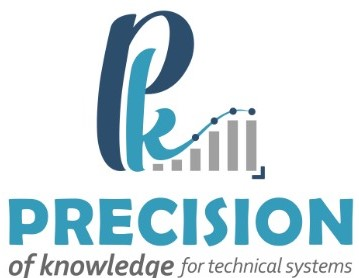

# Project Plan
<!--  -->

**Date:** 3-09-2023

**Project:** Data Cleansing tool

**Client:** Eastern Region Municipality

**Project Manager:** Eng. Sarah Al-Thabit

## Milestones
| Milestone      | Start Date | End Date   | Percentage Completed | Description                                           |
| -------------- | ---------- | ---------- | --------------------- | ----------------------------------------------------- |
| Milestone 1   | 2023-07-30 | 2023-08-22 | 100%                  | Setting up the Server and Development Environment for the CLI Version   |
| Milestone 2   | 2023-08-23 | 2023-9-15 | 35%                   | CLI Prototype                                         |
| Milestone 3   | 2023-9-16 | 2023-10-16 | 0%                   | Building Web Version (Dashboard) Prototype                     |
| Milestone 4   | 2023-10-17 | 2023-12-31 | 0%                    | Final Version(Dashboard) Version                                         |

## Milestone Details

### Milestone 1: Setting up the Server and Development Environment for the CLI version
**Details:**

- Setting up the Python development environment with Python 3.8.10, pip3, and required libraries.
- Setting up Docker for containerization.

### Milestone 2: CLI Prototype

**Details:**

- Detecting errors in Hijri dates of all tables in the database.
- Generating statistics about the types of errors.
- Identifying the exact rows that contain errors.

### Milestone 3: Dashboard Prototype

**Details:**

- setting up the server for dashboard version
- Developing a web dashboard with the same features as the CLI client.
- Allowing users to connect to a database and select columns for Hijri date tests.
- Generating reports in the form of a dashboard.

### Milestone 4: Final Version of the Dashboard

**Details:**
- Completion of the core software package.
- Development of the API.
- Finalization of the interactive web-based Dashboard.