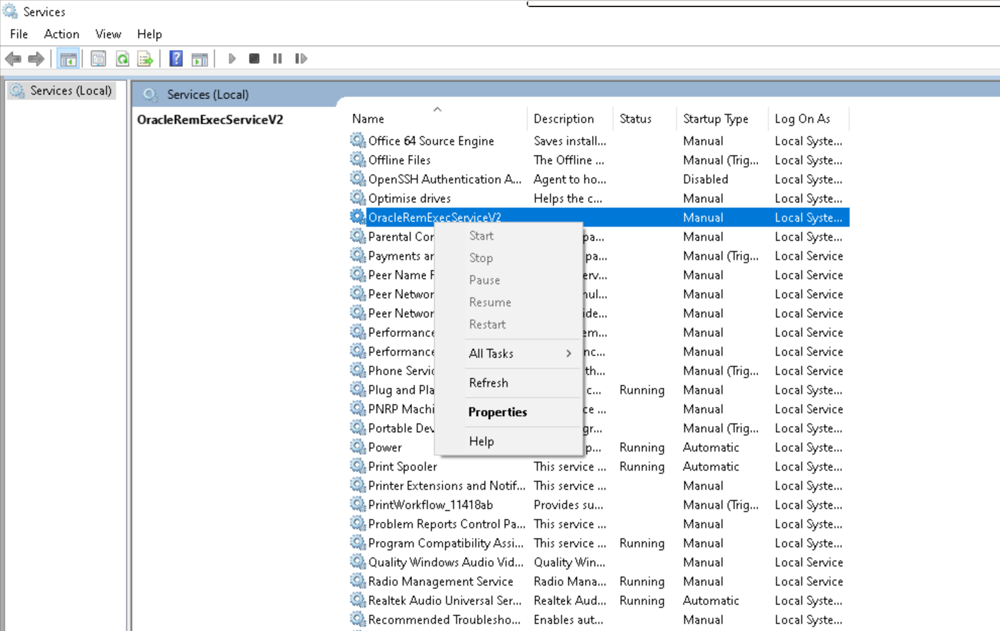

# Request for Oracle Database Configuration Modification

Dear Sarah Al thabit

I hope this message finds you well. I am writing to request your assistance in making a crucial configuration change to your Oracle database. This change is essential to enable remote connections to the database, which is a key requirement for our ongoing project.

To achieve this, we need to configure Oracle to listen on all IP addresses, as it currently only accepts connections from localhost. Below are the steps to accomplish this task:

## Solution1

**Step 1 - Edit listener.ora File:**

This file can be found in the following locations based on your operating system:

- Windows: `%ORACLE_HOME%\network\admin\listener.ora`

Please open the `listener.ora` file and replace occurrences of "localhost" with "0.0.0.0." The relevant section should resemble the following:

```plaintext
LISTENER =
  (DESCRIPTION_LIST =
    (DESCRIPTION =
      (ADDRESS = (PROTOCOL = IPC)(KEY = EXTPROC1521))
      (ADDRESS = (PROTOCOL = TCP)(HOST = 0.0.0.0)(PORT = 1521))
    )
  )
```

**Step 2 - Restart Oracle Services:**

After saving the changes to the `listener.ora` file, please proceed to restart Oracle services. You can do this on Windows by pressing WinKey + r and executing the necessary commands.



## Solution2
**Step 1 - Edit tnsnames.ora File:**

This file can be found at the following location:
`C:\app\client\epm-pc\product\19.0.0\client_1\network\admin\tnsnames.ora`

Please open the `tnsnames.ora` file and replace occurrences of `localhost` or `epm-scan-01` with `0.0.0.0` The relevant section should resemble the following:

```shell

epmtpdb10 =
  (DESCRIPTION =
    (ADDRESS = (PROTOCOL = TCP)(HOST = 0.0.0.0)(PORT = 1622))
    (CONNECT_DATA =
      (SERVER = DEDICATED)
      (SERVICE_NAME = epmtpdb12.eamana.gov.sa)
    )
  )
```


**Step 2 - Restart Oracle Services:**

After saving the changes to the `listener.ora` file, please proceed to restart Oracle services. You can do this on Windows by pressing WinKey + r and executing the necessary commands.


This configuration adjustment will allow us to establish remote connections to the Oracle database, which is pivotal for our project's success. We greatly appreciate your support in implementing this change.


Thank you for your prompt attention to this matter. We look forward to the successful completion of this configuration update and the continued progress of our project.

Best regards,
