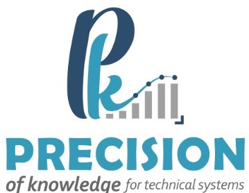

# Project Plan
<!--  -->

**Date:** 6-09-2023

**Project:** Data Cleansing tool

**Client:** Eastern Region Municipality

**Project Manager:** Eng. Sarah Al-Thabit

## Milestones
| Milestone      | Start Date | End Date   | Percentage Completed | Description                                           |
| -------------- | ---------- | ---------- | --------------------- | ----------------------------------------------------- |
| Milestone 1   | 2023-07-30 | 2023-08-22 | 100%                  | Setting up the Server and Development Environment for the CLI Version   |
| Milestone 2   | 2023-08-23 | 2023-9-15 | 90%                   | CLI Prototype                                         |
| Milestone 3   | 2023-09-16 | 2023-9-30 | 60%                   | Error Detection And Data Correction|
| Milestone 4   | 2023-10-1 | 2023-11-24 | 0%                   | Web Dashboard|

## Milestone Details

### Milestone 1: Setting up the Server and Development Environment for the CLI version
**Details:**

- Setting up the Python development environment with Python 3.8.10, pip3, and required libraries.
- Setting up Docker for containerization.

### Milestone 2: CLI Prototype

**Details:**

- Detecting errors in Hijri dates of all tables in the database.
- Generating statistics about the types of errors.
- Identifying the exact rows that contain errors.

### Milestone 3: Error Detection and Data Correction

**Details:**
- Development of sophisticated algorithms for error detection in data.
- Implementation of advanced data correction algorithms based on business owner decisions.
- Integration of error detection and correction mechanisms into the data cleansing tool.
- Testing and validation of error detection and correction processes on sample datasets.
- Documentation of error detection and correction algorithms for future reference.
- Conducting user acceptance testing (UAT) to ensure the accuracy and effectiveness of error detection and correction features.
- Fine-tuning of algorithms and processes based on UAT feedback.
- Preparation for the integration of error detection and correction into the production environment.

### Milestone 4: Final Version of the Dashboard

**Details:**
- Completion of the core software package, encompassing all necessary features and functionality.
- Thorough development and documentation of the API to ensure seamless communication between components.
- Finalization of the interactive web-based Dashboard, including user interface enhancements and user experience optimization.
- Rigorous quality assurance and testing procedures to identify and rectify any issues.
- Performance optimization to guarantee efficient operation, even under heavy usage.
- Integration with production infrastructure, ensuring seamless deployment and scalability.
- User training and onboarding preparations for a smooth transition to the final version.
- Coordination with stakeholders for final approval and user acceptance testing.